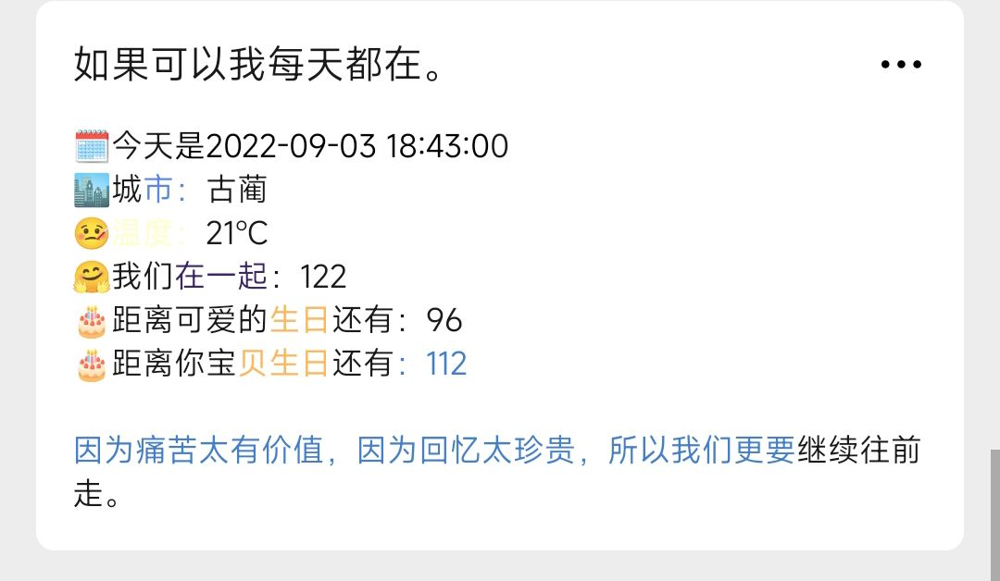
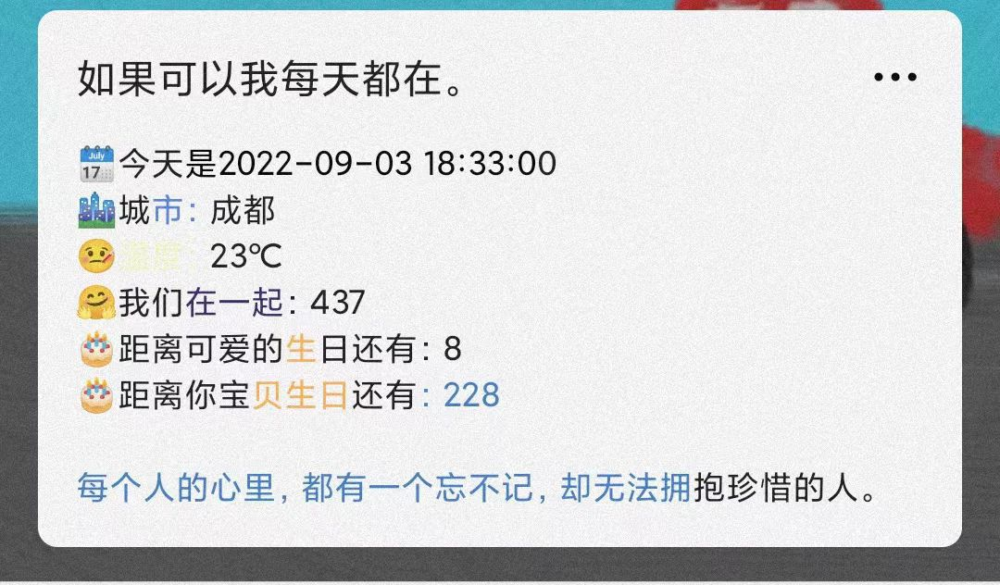
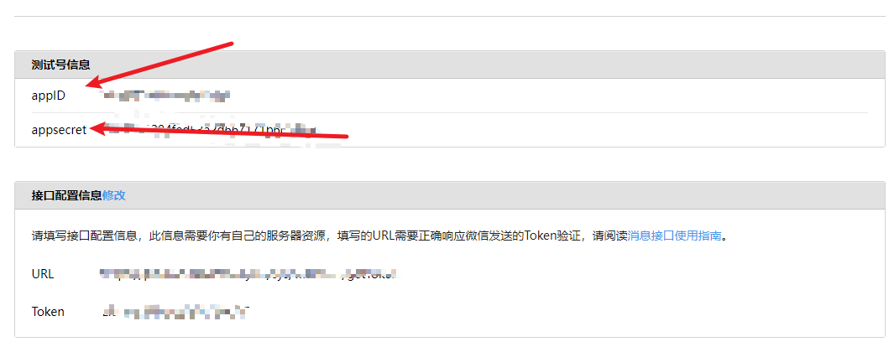
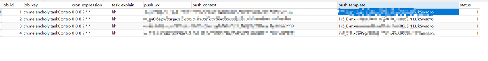

# partnerPush

#### 介绍
公众号定时推送早安问候以及天气预报，情侣tips推送关心，每天定时对朋友、闺蜜、恋人进行信息推送，可一个公众号对多个微信用户进行信息推送，可设置不同时间。

助力每一个爱情故事。

#### 软件架构
SpringBoot+SpringScheduled+httpClient+Mybatis-plus+微信公众号接口。
通过该服务架构配合微信公众号提供api接口，实现对指定关注人信息推送。
从数据库中获取我们不同执行任务，采用Scheduled线程池，对不同时间段需要推送的时间不一致。

#### 演示效果




#### 安装教程

1. 申请公众和测试账号的app-id 和 app-secret [申请地址](https://mp.weixin.qq.com/debug/cgi-bin/sandbox?t=sandbox/login)

2. 添加模板信息

```html
🗓️今天是{{data.DATA}} 
🏙️城市：{{ctiy.DATA}}
🤒温度：{{temperature.DATA}} 
🤗我们在一起：{{startTime.DATA}}
🎂距离可爱的生日还有：{{he.DATA}} 
🎂距离你宝贝生日还有：{{mine.DATA}} 

{{hitokoto.DATA}}
```
3. 进行天气接口ack申请：https://lbs.baidu.com/index.php?title=webapi/weather
4. 导入根目录下的数据库partnerpush.sql
5. 主要设置的字段详细：
   1. job_key:这个不需要管，不能为空默认值为：“cn.melancholy.taskController.task.TaskRunnable”
   2. cron_expression:时间表达式（0 0 8 ? * *   默认每天早上八点。）
   3. push_wx：指定推送人。
   4. push_context：推送内容，注意格式一定要用“|”分割——>(510525(城市-行政区划分代码)|1651604583000(纪念日开始时间)|1638903783000（ta的生日）|977587200000（你的生日）)
   5. push_template: 模板ID
   6. status: 是否进行推送。
6. 在src/main/resources/application.yml中对数据库地址、用户名、密码进行修改。
7. 上述操作完成之后，打包发布即可。

#### 城市天气 和 一言
天气服务接口文档：https://lbs.baidu.com/index.php?title=webapi/weather(已内置)
一言接口：https://developer.hitokoto.cn/introduce/(已内置)

**注意事项**
天气接口需要使用到官方的ack。所以需要到官方百度官方网站进行申请，
申请成功后拿到ack，将其复制到src/main/resources/application.yml中app_baidu_ack： 之后即可。

#### 使用说明

按照以上操作完成后，即可打包发布。

该程序使用采用多线程进行开发，设置数据库后自动读取数据库信息，支持添加关注公众号多个账户。

数据库展示。


#### 参与贡献

    DVPG_R

#### 打包发布：关于 SpringBoot 项目编译打包，这里就不用多说了
    方法一：通过 IDEA 的方式
    方式二：通过 maven 的方式

#### 温馨提示
通常情况下只需要在 src/main/resources/application.yaml 文件中配置信息，不需要修改其它任何代码